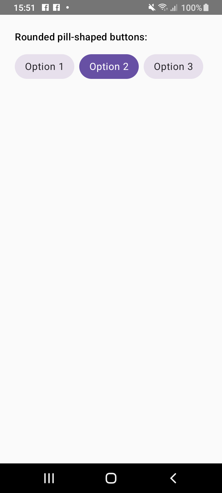
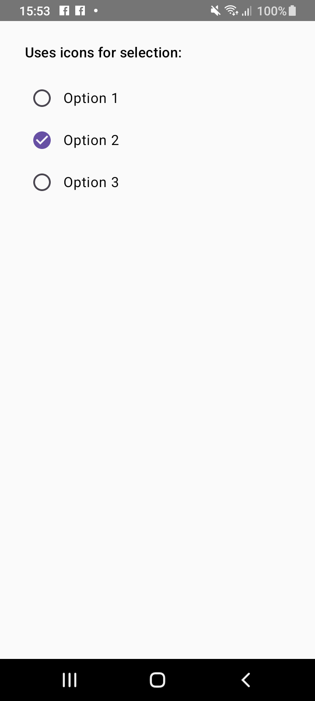
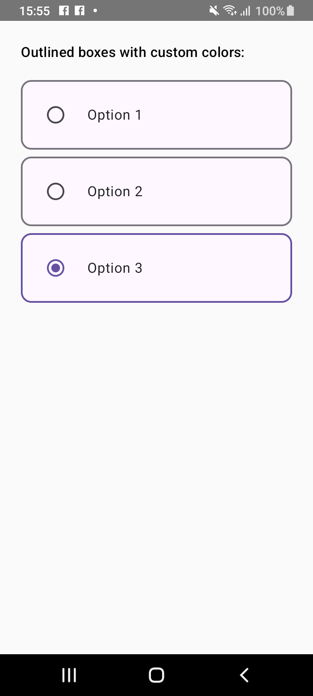

# Advanced Radio Group for Jetpack Compose

[](https://kotlinlang.org/)
[](https://developer.android.com/)
[](https://developer.android.com/jetpack/compose)
[](LICENSE)

---

## 🚀 Overview
**Advanced Radio Group** is a fully customizable Material 3-based radio button module for Jetpack Compose.  
Designed for Android developers, it offers **multi-style radio buttons** with **editable colors, shapes, and icons**. Perfect for **reusable modules** in Android apps and for enhancing your portfolio.

---

## 🎨 Styles Included

| Style Name | Preview |
|------------|---------|
| **Capsule Radio** |  |
| **Icon Radio** |  |
| **Rounded Radio** |  |

---

## ⚡ Features
- 3+ **unique Material 3 radio styles**
- Fully **customizable** (colors, sizes, shapes, icons)
- **Composable API** — works seamlessly with Jetpack Compose
- **Reusable module** for Android projects
- **Vertical scroll support** for large option lists
- Lightweight and dependency-friendly

---

## 📦 Installation

Add this module as a dependency in your app’s `build.gradle`:

```gradle
dependencies {
    implementation("com.palak.advancedradio:advancedradio:1.0.0")
}
